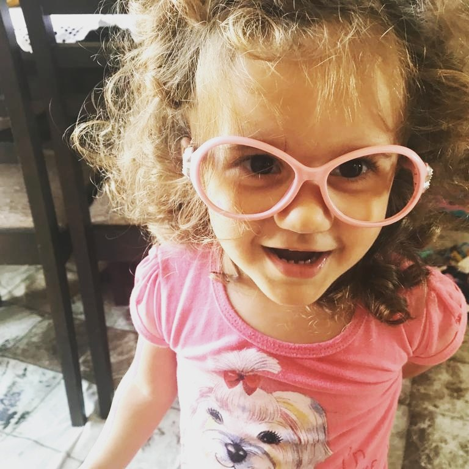

# talita-dictionary

O incrível vocabulário da Talita

## Talita Dictionary

2 yo vocabulary

- Ma ma ma ma ma ma gui
- Picoca
- Nana não
- Buiuuu
- Chocolia
- Salia
- Salinha
- Vem vem
- Gulutus
- Chubeca
- Bolinha
- Que fome
- Mimi
- Miki
- Bana
- Maça
- Suki
- Uni
- Dicupa
- Ajuda
- Socorro
- Sobe
- Desce
- No que
- Não podi
- Agora não
- Suculo
- Cabo
- Que vê
- Papai
- Que nana
- Sim
- Coyo
- Passa
- Piupiu
- Peti
- TV
- Poti poti
- Brilha Brilha
- Itita
- Tidita
- Maju
- Dadi
- Manu
- Passia
- Nana
- Mama
- Manga
- Uva
- Fanghinho
- Bush
- Ovo
- Woody
- Icola
- Jassy
- Bola
- Sapato
- Abre
- Sapato bota
- Pé meia
- Um... Dez
- Pato
- Pekeka
- Pepa
- Susi
- Dinossaulo
- Vovô
- Vovó
- Tia Caiol
- Lolo
- Tio Boia
- Papa
- Papai
- Mamão
- Dani
- Aquel
- Carro
- Titia
- Galinha
- Popohttps://github.com/danielscarvalho/talita-dictionary/
- Pintadinha
- Calijó
- Piu piu
- Jay Jay
- Toke Toke Toke
- Budia
- Esse
- Otro
- Giafa
- É meu!
